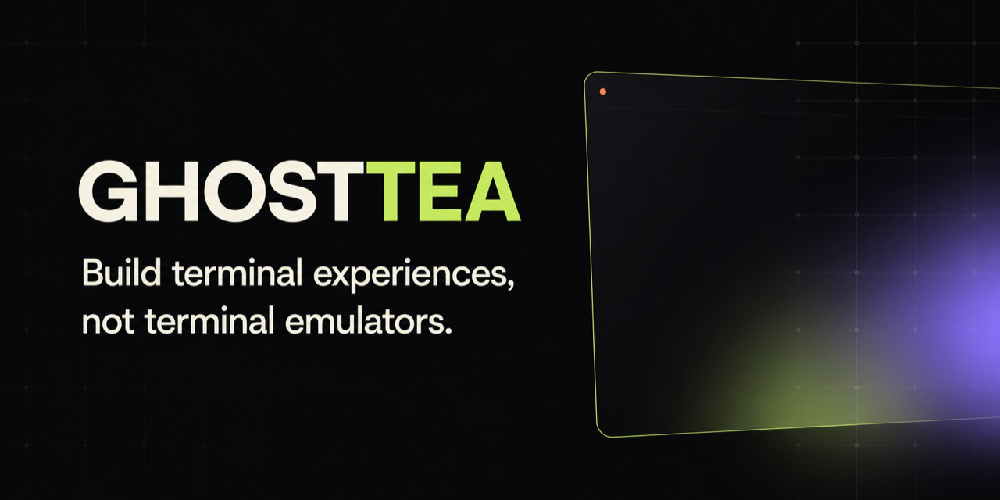

<div align="center">

<sub>VIBECOOK / GHOSTTY-POWERED TERMINAL RUNTIME</sub>

# ghosttea

### Ship the Ghostty experience across platforms.

Put the terminal experience developers already love inside your product—WebGPU on macOS and Windows, native Metal on iOS.

[Website](https://vibecook-dev.github.io/ghosttea/) ·
[API guide](https://vibecook-dev.github.io/ghosttea/api.html) ·
[npm](https://www.npmjs.com/org/vibecook) ·
[crates.io](https://crates.io/search?q=ghosttea)

[](https://github.com/vibecook-dev/ghosttea/actions/workflows/desktop-release-gates.yml)
[](https://www.npmjs.com/package/@vibecook/ghosttea)
[](LICENSE)

</div>

## Why

CLI agents have made the terminal the center of modern development. Ghostty set the bar for how fast, native, and calm that surface can feel.

`libghostty-vt` provides the terminal core. **ghosttea provides the product layer:** PTYs, WebGPU and Metal surfaces, Electron lifecycle, React workspaces, typed automation, SSH, and shared sessions.

| Ship on             | Integration              | Renderer |
| ------------------- | ------------------------ | -------- |
| Apple Silicon macOS | Electron + React         | WebGPU   |
| x64 Windows         | Electron + React         | WebGPU   |
| iOS 18.1+           | Native Swift composition | Metal    |

## Run it

```bash
git clone https://github.com/vibecook-dev/ghosttea.git
cd ghosttea
npm install
npm run fetch:ghostty-vt
npm run dev
```

Requires Node 22+ and Rust 1.88+. Locked native artifacts are available for Apple Silicon macOS and x64 Windows.

## Embed it

```bash
npm install @vibecook/ghosttea-electron @vibecook/ghosttea-react
```

Start high-level and drop down only when you need control:

| Need                           | Use                                  |
| ------------------------------ | ------------------------------------ |
| Complete terminal workspace    | `@vibecook/ghosttea-react/workspace` |
| Terminal surfaces in custom UI | `@vibecook/ghosttea-react`           |
| Electron lifecycle + transport | `@vibecook/ghosttea-electron`        |
| Headless automation            | `@vibecook/ghosttea-client`          |
| Native composition             | `ghosttea` + `ghosttea-core`         |

The [API guide](https://vibecook-dev.github.io/ghosttea/api.html) is the shortest path from install to first terminal.

## What you get

- Ghostty VT semantics, text shaping, reflow, selection, and scrollback
- Local PTYs and direct SSH
- WebGPU desktop and Metal iOS rendering
- Sandboxed Electron transport and a complete React workspace
- Human-safe automation and logical session sharing

Local frames skip Electron main and React state. Shared sessions move terminal state—not screenshots—so each device renders sharp pixels locally.

## Status

macOS and Windows desktop targets are release-gated. The native iOS app is implemented and device-tested; external release qualification remains in progress. See the [qualification record](apple/GhostteaKit/Compatibility/release-hardening.md).

## Project

- [Documentation](https://vibecook-dev.github.io/ghosttea/)
- [Questions and bug reports](https://github.com/vibecook-dev/ghosttea/issues)
- [Changelog](CHANGELOG.md)
- [Publishing](PUBLISHING.md)

MIT © 2026 James Yong. ghosttea is a VibeCook project built independently on `libghostty-vt` and is not affiliated with Ghostty.
